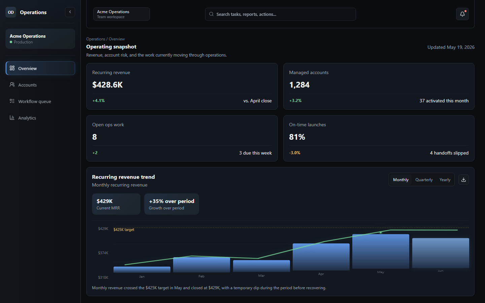
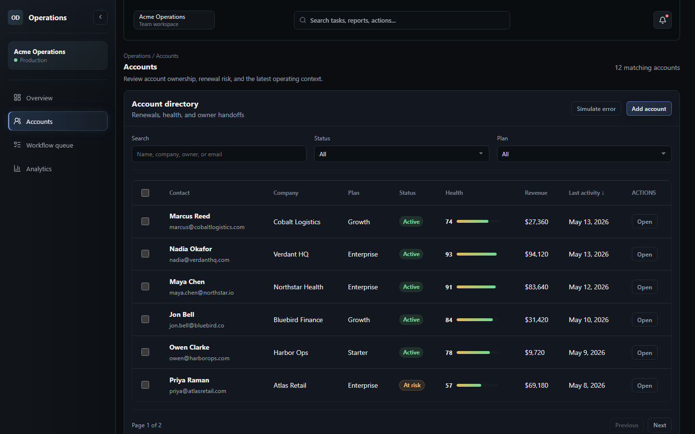
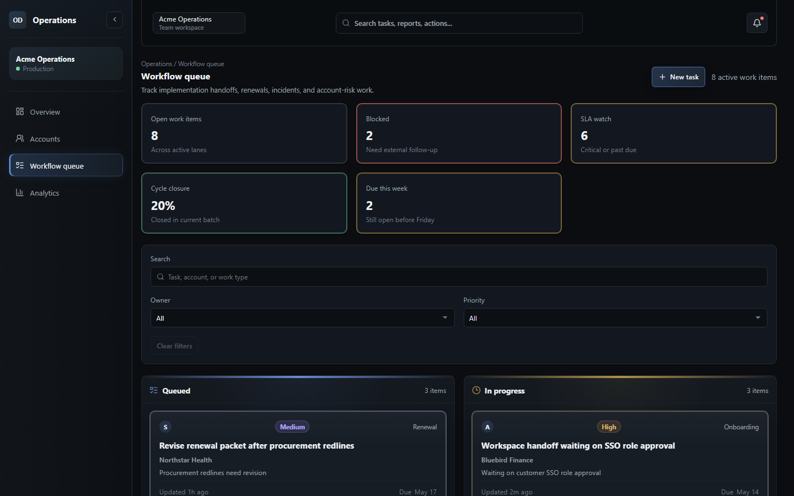
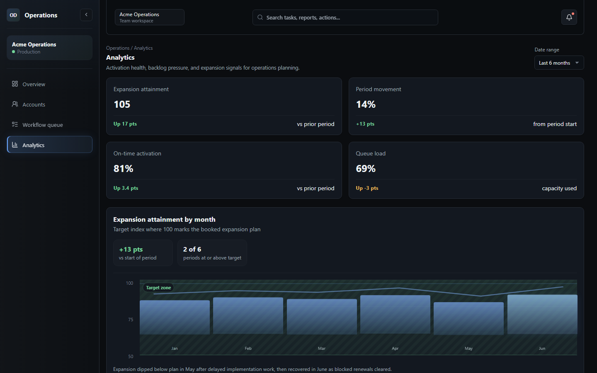
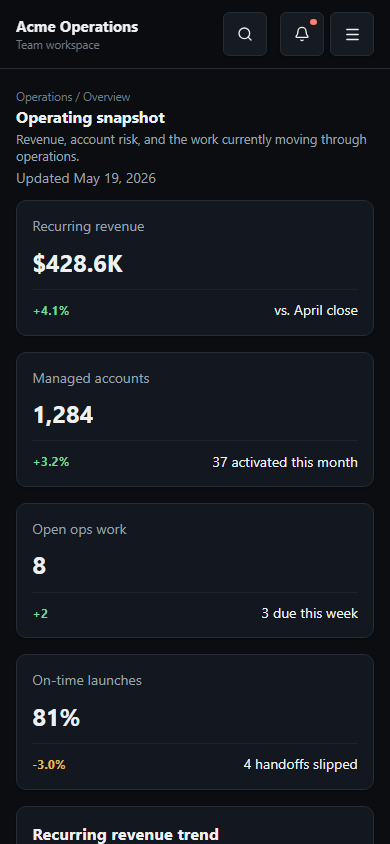

# Operations Dashboard

[](https://github.com/AlexHorodnic/operations-dashboard/actions/workflows/ci.yml)

A responsive Angular operations platform for account management, workflow coordination, onboarding visibility, and revenue operations reporting.

Live site: [`https://operations.alexhorodnic.com`](https://operations.alexhorodnic.com)

Portfolio case study: [`alexhorodnic.com/projects/operations-dashboard`](https://www.alexhorodnic.com/projects/operations-dashboard)

---

## Overview

Operations Dashboard is a production-inspired internal SaaS/admin interface built with Angular. It models the type of workspace an operations, customer success, or revenue operations team might use to monitor account health, coordinate implementation work, track operational blockers, and review business performance.

The project focuses on realistic enterprise frontend patterns: responsive layouts, drawers, workflow boards, operational activity feeds, filters, mobile-friendly interactions, and a maintainable feature-first Angular structure.

---

## Project Goals

This project was built to demonstrate:

- Production-style Angular frontend architecture
- Realistic internal SaaS UX patterns
- Responsive enterprise dashboard design
- Maintainable feature-based project organization
- Clean component reuse without overengineering
- Mobile and desktop interaction polish
- Believable operational data presentation

---

## Key Features

### Dashboard Overview

- Operating snapshot with account, revenue, and workflow KPIs
- Revenue trend visualization
- Operational activity feed
- Loading, empty, and error states
- Responsive card and chart layouts

### Account Operations

- Account directory with filtering, sorting, and search
- Desktop table and responsive account card views
- Account detail drawer
- Bulk account selection actions
- Owner assignment workflow
- CSV export support
- Mobile sticky action behavior

### Workflow Queue

- Kanban-style workflow board for desktop
- Task status columns for queued, in-progress, blocked, and completed work
- Angular CDK drag-and-drop support
- Mobile-friendly stacked workflow layout
- Task detail drawer with overview, activity, comments, and related account context
- Task creation flow
- Undoable task deletion notification

### Analytics

- Revenue and operational analytics panels
- Responsive chart cards
- Tooltip and hover interactions
- More realistic, uneven operational data patterns
- SaaS-style dark analytics presentation

### Mobile UX

- Sticky mobile app bar
- Mobile navigation sheet
- Mobile-friendly drawers and modals
- Safe-area spacing support
- Touch-friendly controls
- Reduced accidental overflow and layout shifting
- Improved input behavior for mobile browsers

---

## Tech Stack

- **Angular**
- **TypeScript**
- **SCSS**
- **RxJS**
- **Angular CDK**
- **Angular Router**
- **Angular Forms**
- **Lucide Angular** for icons
- **Vercel Analytics**
- **Vitest / Angular test tooling**
- **Vercel** deployment

---

## Frontend Architecture

The project uses a feature-first Angular structure designed to stay easy to navigate for a solo developer while still feeling scalable.

```text
src/app/
  core/
    models/
    services/

  features/
    accounts/
    analytics/
    overview/
    workflow/

  mock-data/

  shared/
    components/
      badge/
      command-palette/
      drawer/
      empty-state/
      kpi-card/
    utils/
```

### Structure Notes

- `features/` contains route-level product areas.
- `core/` contains shared application models and services.
- `shared/components/` contains reusable UI components.
- `mock-data/` contains realistic demo data used by the frontend.
- `shared/utils/` contains small reusable utilities such as CSV export logic.

The architecture intentionally avoids unnecessary enterprise layering. Folder names are kept direct and product-oriented so the codebase remains easy to understand months later.

---

## Styling Architecture

Global styling is organized into SCSS partials for readability and maintainability.

```text
src/styles/
  base/
  layout/
  components/
  pages/
  utilities/
```

This keeps design tokens, reset styles, layout rules, reusable component styling, page-specific styles, and responsive utilities separated without introducing excessive abstraction.

---

## Responsive Design

The interface is built to support desktop, tablet, and mobile layouts with behavior tailored to each context.

Responsive work includes:

- Desktop sidebar navigation
- Mobile sticky app bar
- Mobile navigation sheet
- Responsive tables and account cards
- Workflow board adaptation for smaller screens
- Drawer and modal sizing fixes
- Safe-area spacing for modern mobile devices
- Touch target improvements
- Mobile input sizing to reduce browser zoom issues
- Horizontal overflow prevention across major layouts

Tested responsive widths include common mobile, tablet, desktop, and wide desktop breakpoints.

---

## UX Highlights

- Dark SaaS dashboard interface
- Realistic account and workflow data
- Operational activity and blocker states
- Drawer-based detail views
- Keyboard-accessible controls
- Hover, focus, and active states
- Sticky mobile actions where useful
- CSV export interactions
- Loading, error, and empty states
- Responsive charts and cards
- Mobile-aware workflow interactions

---

## Development Setup

Clone the repository and install dependencies:

```bash
npm install
```

Start the local development server:

```bash
npm start
```

Open:

```text
http://localhost:4200/
```

---

## Scripts

```bash
npm start
```

Runs the Angular development server.

```bash
npm run build
```

Creates a production build in the `dist/` directory.

```bash
npm run watch
```

Runs Angular build in watch mode using the development configuration.

```bash
npm test
```

Runs the Angular test command in watch mode.

```bash
npm run test:ci
```

Runs the complete test suite once for CI.

```bash
npm run typecheck
```

Runs a TypeScript typecheck without emitting files.

---

## Test Strategy

The focused test suite covers behavior with the highest regression risk:

- Local persistence and CRUD behavior in `DashboardDataService`
- Account search, combined filters, sorting, pagination, and page selection
- Workflow filtering, status transitions, deletion, and undo restoration
- Analytics range changes and derived performance metrics
- CSV escaping and browser download behavior
- Application shell and route rendering

GitHub Actions runs typechecking, the test suite, and a production build for every push and pull request to `master`.

---

## Build & Deployment

Create a production build:

```bash
npm run build
```

The compiled output is generated in:

```text
dist/
```

The project is deployed on Vercel.

Live site:

```text
https://operations.alexhorodnic.com
```

---

## Screenshots

### Overview



### Accounts



### Workflow Queue



### Analytics



### Mobile Layout



---

## Notes

This project uses mock data and frontend-managed state to model realistic product behavior. It does not currently include a real backend, authentication system, or production customer data.

---
